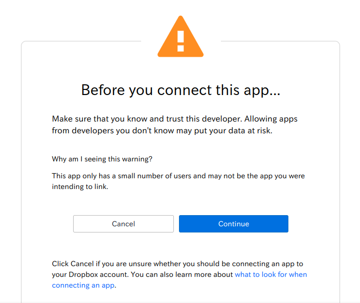
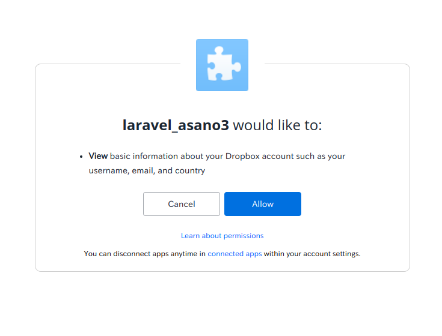
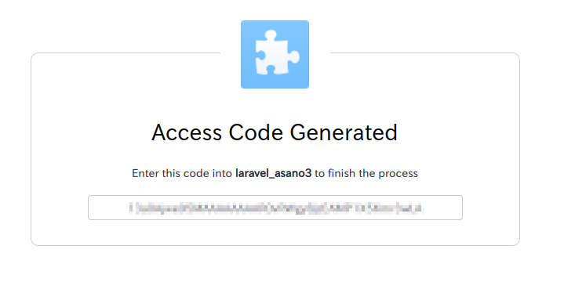

[日本語版 README はこちら](/README_ja.md)

# laravel-dropbox-with-short-lived-access-token
How to integrate dropbox with short-lived access token into laravel

## Summary
This repogitory explains how to integrate dropbox with short-lived access token into laravel. No need to clone or pull this repogitory.

## Introduction
Laravel provides a simple interface for file storage. You can use dropbox for file storage by creating custom filesystems. See the official document [File Storage - Laravel - The PHP Framework For Web Artisans](https://laravel.com/docs/9.x/filesystem#custom-filesystems).

As described in the official document above, you need $config['authorization_token'], namely dropbox access token.

You can generate the access token at [App Console \- Dropbox](https://www.dropbox.com/developers/apps), but the access token is short-lived(only 4 hours) and cannot be used permanently. If you set the short-lived access token at .env file or config/filesystem.php file, it will soon expire and you will encounter an error.

Now I will explain how to generate programmatically a short-lived access token every time. Once you set necessary information, you can use dropbox for file storage in laravel without adjusting it any more.

NOTE:
[spatie/dropbox\-api: A minimal implementation of Dropbox API v2](https://github.com/spatie/dropbox-api) says you can instantiate a Spatie\Dropbox\Client from your refresh token or a pair of your app key and secret, but I couldn't do this. I couldn't understand how to use TokenProvider. When I tried "$client = new Spatie\Dropbox\Client([$appKey, $appSecret]);", there was no error but I couldn't upload the file into dropbox.

## Usage

### Set laravel files
Basically, follow the instruction in the official document [File Storage - Laravel - The PHP Framework For Web Artisans](https://laravel.com/docs/9.x/filesystem#custom-filesystems).

First, install [spatie/flysystem\-dropbox: A flysystem driver for Dropbox that uses the v2 API](https://github.com/spatie/flysystem-dropbox).

```
composer require spatie/flysystem-dropbox
```

Next, create a service provider. I named it DropboxServiceProvider instead of AppServiceProvider.

I defined a function which gets a short-lived access token from your app key, app secret and refresh token.

app/Providers/DropboxServiceProvider.php
```
<?php

namespace App\Providers;

use Illuminate\Filesystem\FilesystemAdapter;
use Illuminate\Support\Facades\Storage;
use Illuminate\Support\ServiceProvider;
use League\Flysystem\Filesystem;
use Spatie\Dropbox\Client as DropboxClient;
use Spatie\FlysystemDropbox\DropboxAdapter;

class DropboxServiceProvider extends ServiceProvider
{
    public function boot()
    {
        //a function which gets a short-lived access token from your app key, app secret and refresh token
        function get_short_lived_access_token($config) {
            $ch = curl_init('https://api.dropbox.com/oauth2/token');
            $options = array(CURLOPT_POSTFIELDS => 'grant_type=refresh_token&refresh_token='.$config['refresh_token'],
                             CURLOPT_USERNAME => $config['app_key'],
                             CURLOPT_PASSWORD => $config['app_secret'],
                             CURLOPT_RETURNTRANSFER => true
                            );
            curl_setopt_array($ch, $options);
            $response = json_decode(curl_exec($ch));
            curl_close($ch);
            $short_lived_access_token = $response->access_token;
            return $short_lived_access_token;
        }

        //dropbox extention
        Storage::extend('dropbox', function ($app, $config) {
            $adapter = new DropboxAdapter(new DropboxClient(
                 get_short_lived_access_token($config)
            ));
 
            return new FilesystemAdapter(
                new Filesystem($adapter, $config),
                $adapter,
                $config
            );
        });
    }
}
```

Register this provider in config/app.php
```
...
'providers' => [
    ...
    App\Providers\DropboxServiceProvider::class,
],
...
```

Set the dropbox config in config/filesystems.php
```
...
'disks' => [
    ...
    'dropbox' => [
        'driver' => 'dropbox',
        'app_key' => env('DROPBOX_APP_KEY'),
        'app_secret' => env('DROPBOX_APP_SECRET'),
        'refresh_token' => env('DROPBOX_REFRESH_TOKEN')
    ],
    ...
],
...
```

### Get the necessary information(your app key, app secret and refresh token) and set them in the .env file

1. Your app key

First, create app at [App Console \- Dropbox](https://www.dropbox.com/developers/apps).

After finishing creating the app, you can see your app key at the app settings.

2. Your app secret

Click "Show" below your app key and you can see your app secret.

3. Your refresh token

Click "Permissions" tab next to the "Settings" tab at your dropbox app page. Check the boxes appropriately for your purpose. For example, you should check files.content.write box if you want to upload files into dropbox.

NOTE:
Be careful to check the boxes before issuing your refresh token.

Visit "https://www.dropbox.com/oauth2/authorize?client_id=YOUR_APP_KEY&response_type=code&token_access_type=offline" from your browser. Replace YOUR_APP_KEY with your actual app key.



Click "Continue" at the browser.



Click "Allow" at the browser. "laravel_asano3" is my dropbox app name.



Your access code is generated and displayed. Copy the access code.

Then, use curl command from the terminal.

```
$ curl https://api.dropbox.com/oauth2/token \
-d code=YOUR_ACCESS_CODE \
-d grant_type=authorization_code \
-u YOUR_APP_KEY:YOUR_APP_SECRET
```

Paste the copied access code in place of YOUR_ACCESS_CODE and replace YOUR_APP_KEY and YOUR_APP_SECRET with your actual app key and app secret respectively.

When this curl command succeeds, some information is returned and displayed like this.

```
{"access_token": "...", "token_type": "bearer", "expires_in": 14400, "refresh_token": "...", "scope": "account_info.read files.content.write files.metadata.read", "uid": "...", "account_id": "dbid:..."}
```

The string after "refresh_token": is your refresh token.

Now you get the necessary information(your app key, app secret and refresh token), so set them in the .env file

.env
```
...
DROPBOX_APP_KEY=YOUR_APP_KEY
DROPBOX_APP_SECRET=YOUR_APP_SECRET
DROPBOX_REFRESH_TOKEN=YOUR_REFRESH_TOKEN
...
```
Replace YOUR_APP_KEY, YOUR_APP_SECRET and YOUR_REFRESH_TOKEN with your actual app key, app secret and refresh token respectively.

That's all. In this way, you can use dropbox for file storage in your laravel app like this.
```
use Illuminate\Support\Facades\Storage;
 
Storage::disk('dropbox')->put('example.txt', 'Contents');
```

## Author
[Asano Naoki](https://asanonaoki.com/blog/)


## License
Under the MIT License. See [LICENSE](/LICENSE) for details.


