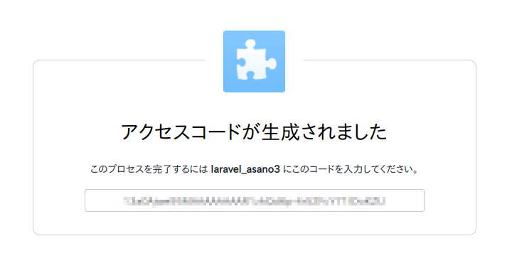

# laravel-dropbox-with-short-lived-access-token
短期アクセストークンを使ってdropboxをlaravelに組み込む方法です。

## 概要
このリポジトリでは、短期アクセストークンを使ってdropboxをlaravelに組み込む方法を示しています。このリポジトリをクローンしたりプルしたりする必要はありません。

## 導入
laravelはファイルストレージのためのシンプルなインターフェイスを提供しています。custom filesystemsを作成することでファイルストレージにdropboxを使うことができます。 公式ドキュメントの[File Storage - Laravel - The PHP Framework For Web Artisans](https://laravel.com/docs/9.x/filesystem#custom-filesystems)を参照してください。

上記の公式ドキュメントに書かれているように、$config['authorization_token']、つまりアクセストークンが必要になります。

[App Console \- Dropbox](https://www.dropbox.com/developers/apps)でアクセストークンを生成することができますが、そのアクセストークンは短期のもので（４時間だけ使えます）、ずっと使い続けることはできません。.envファイルやconfig/filesystem.phpファイルでその短期アクセストークンを設定しても、すぐに失効してエラーが発生するようになります。

以下ではプログラム的にその都度短期アクセストークンを生成する方法を示します。一度必要な情報を設定すると、それ以上調整せずにlaravelのファイルストレージにdropboxを使うことができます。

注:
[spatie/dropbox\-api: A minimal implementation of Dropbox API v2](https://github.com/spatie/dropbox-api)では、リフレッシュトークンかapp keyとsecretのペアからSpatie\Dropbox\Clientインスタンスを作ることができると書かれていますが、私はその方法ではできませんでした。TokenProviderの使い方がわからず、「$client = new Spatie\Dropbox\Client([$appKey, $appSecret]);」を試しても、エラー発生しませんでしたが、ファイルアップロードができませんでした。

## 使い方

### laravelファイルの設定
基本的に、公式ドキュメント[File Storage - Laravel - The PHP Framework For Web Artisans](https://laravel.com/docs/9.x/filesystem#custom-filesystems)の指示に従います。

まず、[spatie/flysystem\-dropbox: A flysystem driver for Dropbox that uses the v2 API](https://github.com/spatie/flysystem-dropbox)をインストールします。

```
composer require spatie/flysystem-dropbox
```

次に、サービスプロバイダを作ります。私はAppServiceProviderではなくDropboxServiceProviderという名前にしました。

app key, app secret, リフレッシュトークンから短期アクセストークンを取得する関数を定義しました。

app/Providers/DropboxServiceProvider.php
```
<?php

namespace App\Providers;

use Illuminate\Filesystem\FilesystemAdapter;
use Illuminate\Support\Facades\Storage;
use Illuminate\Support\ServiceProvider;
use League\Flysystem\Filesystem;
use Spatie\Dropbox\Client as DropboxClient;
use Spatie\FlysystemDropbox\DropboxAdapter;

class DropboxServiceProvider extends ServiceProvider
{
    public function boot()
    {
        //app key, app secret, リフレッシュトークンから短期アクセストークンを取得する関数
        function get_short_lived_access_token($config) {
            $ch = curl_init('https://api.dropbox.com/oauth2/token');
            $options = array(CURLOPT_POSTFIELDS => 'grant_type=refresh_token&refresh_token='.$config['refresh_token'],
                             CURLOPT_USERNAME => $config['app_key'],
                             CURLOPT_PASSWORD => $config['app_secret'],
                             CURLOPT_RETURNTRANSFER => true
                            );
            curl_setopt_array($ch, $options);
            $response = json_decode(curl_exec($ch));
            curl_close($ch);
            $short_lived_access_token = $response->access_token;
            return $short_lived_access_token;
        }

        //dropbox拡張
        Storage::extend('dropbox', function ($app, $config) {
            $adapter = new DropboxAdapter(new DropboxClient(
                 get_short_lived_access_token($config)
            ));
 
            return new FilesystemAdapter(
                new Filesystem($adapter, $config),
                $adapter,
                $config
            );
        });
    }
}
```

このプロバイダをconfig/app.phpに登録します。
```
...
'providers' => [
    ...
    App\Providers\DropboxServiceProvider::class,
],
...
```

dropboxのconfigをconfig/filesystems.phpに設定します。
```
...
'disks' => [
    ...
    'dropbox' => [
        'driver' => 'dropbox',
        'app_key' => env('DROPBOX_APP_KEY'),
        'app_secret' => env('DROPBOX_APP_SECRET'),
        'refresh_token' => env('DROPBOX_REFRESH_TOKEN')
    ],
    ...
],
...
```

### 必要な情報（app key, app secret, リフレッシュトークン）を取得し、.envファイルに設定

1. app key

最初に、[App Console \- Dropbox](https://www.dropbox.com/developers/apps)でappを作ります。

appを作り終えたら、settingsのところでapp keyを確認することができます。

2. app secret

app keyの下のShowをクリックすると、app secretが見えるようになります。 

3. リフレッシュトークン

Settingsタブの隣のPermissionsタブをクリックします。チェックボックスを目的に応じて適切にチェックします。例えば、ファイルをdropboxにアップロードしたければ、files.content.writeのボックスにチェックを入れます。

注:
リフレッシュトークンを発行する前にボックスをチェックすることに注意してください。

ブラウザでhttps://www.dropbox.com/oauth2/authorize?client_id=YOUR_APP_KEY&response_type=code&token_access_type=offline
にアクセスしてください。YOUR_APP_KEYの部分は、実際のapp keyにしてください。


「次へ」をクリックしてください。


「許可」をクリックします。"laravel_asano3"は私が作ったappの名前です。



アクセスコードが生成され、表示されます。そのアクセスコードをコピーします。

そして、curlコマンドを端末から実行します。

```
$ curl https://api.dropbox.com/oauth2/token \
-d code=YOUR_ACCESS_CODE \
-d grant_type=authorization_code \
-u YOUR_APP_KEY:YOUR_APP_SECRET
```

YOUR_ACCESS_CODEの部分に先ほどコピーしたアクセスコードを貼り付けます。YOUR_APP_KEYとYOUR_APP_SECRETの部分は、それぞれ、実際のapp keyとapp secretにしてください。

このcurlコマンドが成功したら、以下のように情報が返却されます。

```
{"access_token": "...", "token_type": "bearer", "expires_in": 14400, "refresh_token": "...", "scope": "account_info.read files.content.write files.metadata.read", "uid": "...", "account_id": "dbid:..."}
```

"refresh_token":の後の文字列がリフレッシュトークンです。

これで必要な情報（app key, app secret, リフレッシュトークン）がそろったので、これらを.envファイルに設定します。

.env
```
...
DROPBOX_APP_KEY=YOUR_APP_KEY
DROPBOX_APP_SECRET=YOUR_APP_SECRET
DROPBOX_REFRESH_TOKEN=YOUR_REFRESH_TOKEN
...
```

YOUR_APP_KEY、YOUR_APP_SECRET、YOUR_REFRESH_TOKENの部分は、それぞれ、実際のapp key、app secret、リフレッシュトークンにしてください。

これで終わりです。あとは以下のようにlaravelのファイルストレージでdropboxを使うことができます。

```
use Illuminate\Support\Facades\Storage;
 
Storage::disk('dropbox')->put('example.txt', 'Contents');
```

## 著者
[浅野直樹](https://asanonaoki.com/blog/)


## License
MITライセンスの元にライセンスされています。詳細は[LICENSE](/LICENSE)をご覧ください。


